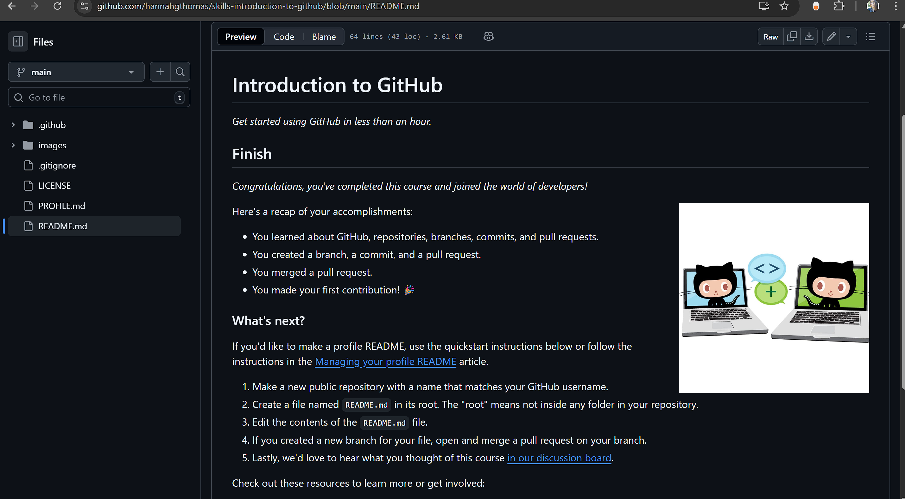
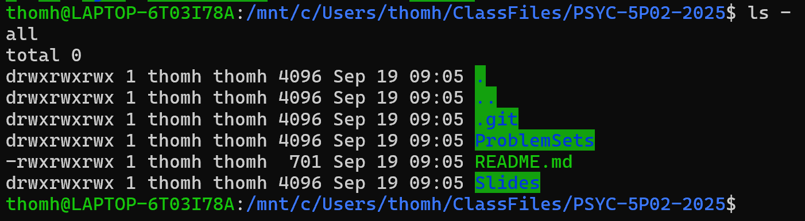

# Problem Set 1 - Hannah Thomas

### Question 1: 

a) The ls command lists the files in the current directory, in order to reverse the order based on when they were last edited you can use the -r command. 

`ls -r`

b) The -l command lists the long version of the files in the current directory, showing the date and time the file was last edited

`ls -lr`


c) The man for -l

> -l     use a long listing format

:memo: 3/3

### Question 2:

If my home directory was users/username and I navigated to users/username/Documents I could use the following commands to move back to home directory:

`users/username/Documents$ cd ../` Moves up the directory by one level

`users/username/Documents$ cd -` Operates like a toggle to move between directories

:memo: **We didn't cover the `cd -' in class, so I was looking for `cd ~'. Also I'm not sure what you mean by toggle. -.5**

`users/username/Documents$ cd users/username` Directly specify the directory I wish to return to

:memo: **2.5/3**


### Question 3:

- Make a directory called 'Data'

`mkdir Data`

- Create a file called 'subj01.txt'

`touch subj01.txt`

- Create four copies of the file you just created for subject 2-5, as well as 11.

```
cp subj01.txt subj02.txt
cp subj01.txt subj03.txt
cp subj01.txt subj04.txt
cp subj01.txt subj05.txt
cp subj01.txt subj11.txt
```

- Move all of the files into the 'Data' directory

`mv * .txt Data` 

- Delete all .txt files from the Data directory except for subj11.txt

`rm subj01.txt subj02.txt subj03.txt subj04.txt subj05.txt`

OR

`rm subj0*.txt` 

Will remove all files except for subj11 because the wildcard * indicates that after 0* anything will be taken. 

:memo: **5/5**

### Question 4:

Using the manual to learn about the function, create a pipe that uses the tee command. Describe the task you're aiming to perform, and provide any and all code needed to complete it. Be sure to upload any files that you needed to run this code.

> The tee command is used to read standard input and writes the output to standard output, copying it to where we specify. The tee command allows you to save the outputs of your commands which are typically pasted into your terminal into a seperate file. 

For example, say I want to keep track of how many words I've used in this assignment. I could us the tee command to read the word count and then store that output into a .txt file.

`wc -w ProblemSet1.md | tee wordcount.txt`

By default, tee will overwrite existing files. If I want to add the word count, say after writing out this question I can use `-a` to append the document and add the output to the end.

`wc -w ProblemSet1.md | tee -a wordcount.txt`

What is output into my terminal is the result from the input of the command `wc -w`, but what is stored in my wordcount.txt file is the output from the 1st and 2nd word count appends. 

**This function seems particularly helpful for debugging code, since you can save multiple attempts and compare the resulting output.** 

:memo: **3/3**

### Question 5:

Using the screen command, open up a screen. Using the history command and a pipe, write your command history to a file. Then exit the screen, and write your history to a new file again. Are these files the same? Why or why not? (Be sure to name them something obvious and upload both files as part of this assignment.)

To write my history using a pipe and write it to a file I used the following code:

`history | tee history_terminal.txt`
`history | tee history_screen.txt`

These files are the same, showing my history for my current session up until I created the screen, the commands I ran within that screen were printed in my history_screen.txt file - I created a `touch screencommands.txt` within that screen as well. When I exited the screen, and ran the history_terminal.txt I could not view what I did ran within the screen, just that I had entered into the screen. However, my screencommands.txt file was there. 

I was confused at first because I assumed that the screen was like creating a new "window" that would not contain everything I had already worked on prior to the screen. But it's still the same login session, just a seperate "shell" within the session.

:memo: **It looks like you saved the two files with the wrong names. -.5  2.5/3**

### Question 6: 



:memo: **3/3**

### Question 7:



:memo: **3/3**

### Question 8:

The command I used to write the last file was:

`history | tail -n 4 > git_commit_commands.txt`

- `head` will print the top of the history 
- `tail` will print the bottom of the history
- `n 4` specifies how many lines from the tail

:memo: **3/3**

:memo: **Total:** 25/26

